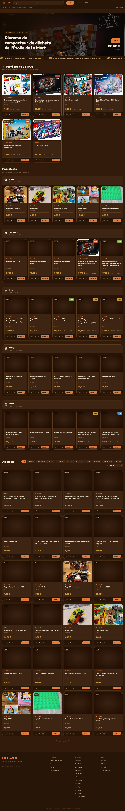

# Lego Market

Lego Market is an aggregation website designed to help you find the best Lego deals online. It scrapes deals from multiple sources, including Dealabs, Vinted, and Avenue de la Brique, and cross-references them with a complete local catalog of Lego sets powered by the Rebrickable API.

### 📸 Screenshots


*The main dashboard displaying Hot Deals, Franchises, and All Deals.*

## ✨ What you can do (Features)

- **Centralized Deal Aggregation:** Pulls Lego deals from Avenue de la Brique, Dealabs, and Vinted into one unified dashboard.
- **Smart Franchise Categorization:** Automatically maps listings to popular franchises (e.g., Star Wars, Harry Potter, Technic) for easy browsing.
- **Comprehensive Lego Catalog:** Syncs and stores over 25,000 Lego sets locally using the Rebrickable API, giving you instantly available detailed metadata about each set.
- **Advanced Filtering and Sorting:** Sort your deals by the biggest discount, the best price, highest upvotes, or filter by specific Lego themes.
- **Spotlight Deals:** Highlights the absolute best bargains in a dedicated "Too Good to Be True" section.
- **Detailed Set Views:** View the details of a specific Lego set, including price comparisons, piece count, mini-figures, and historical background data.

The platform provides a clean, user-friendly interface to spot the best discounts and rarest finds.

## 🛠️ How it was made

The project is built on a lightweight, modern tech stack:

- **Backend:** Node.js with Express. It serves a REST API to power the frontend interface.
- **Database:** Local SQLite database using `better-sqlite3`. It holds the entire Lego catalog offline and stores scraped deals efficiently.
- **Scraping:** Custom scrapers built with `axios` for fetching HTML and `cheerio` for parsing it. Background jobs are scheduled using `node-cron` to keep deals up to date.
- **Frontend:** A Single Page Application (SPA) built with vanilla HTML, CSS, and JavaScript, located in the `public` directory.

## 🚀 How to implement (Local Setup)

To run this project locally, follow these steps:

### Prerequisites
- [Node.js](https://nodejs.org/) (v16 or higher recommended)
- A free API key from [Rebrickable](https://rebrickable.com/api/) to sync the Lego catalog.

### Installation

1. **Clone or download the repository:**
   Navigate your terminal to the project directory.

2. **Install dependencies:**
   Run the following command to install required Node.js packages:
   ```bash
   npm install
   ```

3. **Configure Environment Variables:**
   Copy the `.env.example` file to a new file named `.env`:
   ```bash
   cp .env.example .env
   ```
   Open `.env` and assign your Rebrickable API key:
   ```env
   REBRICKABLE_API_KEY=your_api_key_here
   PORT=3000
   ```

4. **Start the Application:**
   Start the Node.js server:
   ```bash
   npm start
   ```
   *Alternatively, use `npm run dev` for development.*

5. **First Run Setup:**
   When you start the server for the first time, it will:
   - Synchronize the entire Lego catalog from Rebrickable and save it to the local SQLite database.
   - Run an initial scrape across all configured sources (Avenue de la Brique, Dealabs, Vinted).
   
   *Note: This initial process might take a few minutes.*

6. **View the website:**
   Open your browser and navigate to `http://localhost:3000`.

---

## 📅 Changelog

### v2.0.0
- **Franchise Tagging Upgrades:** Improved accuracy for tagging Lego sets by leveraging franchise data directly from Avenue de la Brique, and implementing advanced keyword matching algorithms for Dealabs and Vinted listings.
- **Dealabs Scraper Fixes:** Adjusted HTML selectors to accurately extract high-quality images from Dealabs deals.
- **Offline Catalog:** Integrated the entire Rebrickable catalog (~25k sets) offline within the SQLite database to significantly reduce API calls and improve performance.
- **Expanded Frontend UI:** Added new category icons and enriched the user experience for browsing deals by specific franchises (e.g., Star Wars, Harry Potter, Video Games).
